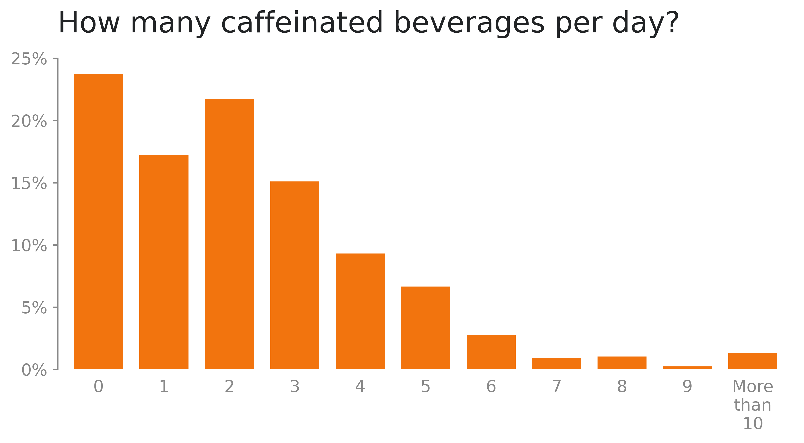
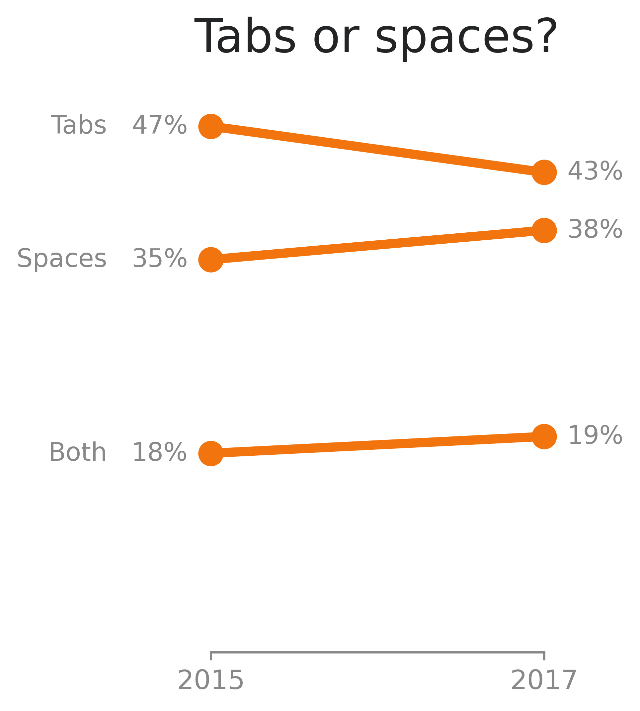
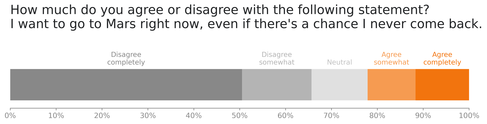

# Stack Overflow Surveys

An analysis of Stack Overflow's annual survey responses. The project uses the CRISP-DM process and is divided into the following parts:

## 1. Business understanding

Ever since 2011, [Stack Overflow](https://stackoverflow.com) makes an annual developer survey with the intention of evaluating the demographics, usage of technologies, education level, employment status, salary range and much more from the developer community. In their own words: 

> *Our Annual Developer Survey examines all aspects of the developer experience from career satisfaction and job search to education and opinions on open source software.*

In 2021, it was fielded from May 25 to June 15. With nearly 80,000 responses from over 180 countries and dependent territories. The results are already public, alongside a detailed report containing the main insights. You can check them here:

[Stack Overflow Annual Developer Survery - 2021 Report](https://insights.stackoverflow.com/survey/2021)

This project focuses on the most unusual and curious questions made since the beginning of the surveys. Besides that, I also take this opportunity to apply some data visualizations good practices. The analysis was made taking the raw data from 2021 and previous years, exploring and processing it with Python in a Jupyter Notebook and then plotting the graphs using the Matplotlib library.

## 2. Data understanding

### 2.1. Load datasets

Import the required libraries and load the datasets from the local directory. The CSV files used are available in the `data/` folder from this repository.

### 2.2. Exploratory data analysis

Explore the questions and answers to be worked with throughout the rest of the notebook, with a quick Pandas summary of them. Eight questions were selected to be ploted, they are:

1. How many caffeinated beverages per day?
2. Tabs or spaces? (2015 and 2017)
3. How much do you agree or disagree with the following statement? I want to go to Mars right now, even if there's a chance I never come back.
4. Star Wars or Star Trek?
5. Dogs or cats?
6. Do you believe in aliens?
7. How do you pronouce "GIF"?
8. Are you the "IT support person" for your family?

### 2.3. Null values

Some questions have a relatively high percentage of null values, like Star Wars vs. Star Trek, with 38% of nulls. However, the absolute number is still high enough (34,398 respondents, for the previous example) to provide representative descriptive statistics. Since any input method for the missing data would add a bias, the null values will just be removed.

## 3. Data preparation

Transform the data into the correct format to be ploted. Since the datasets provided by Stack Overflow are already clean, this means mainly making aesthetical adjustments to strings, extrating the x and y values from the DataFrames and turning some absolute values into percentages.

## 4. Descriptive statistics

### 4.1. Support functions

Create functions to plot the data with Matplotlib. The visualizations also use a custom Matplotlib style sheet, available in `style/minimal.mplstyle`, as a starting point for the plots.

### 4.2. Visualizations

The visualizations are inspired by the book [Storytelling with Data](https://www.storytellingwithdata.com), from Cole Nussbaumer Knaflic. Some examples of the graphs produced can be seen below.

### 4.3. Export images

Save the plots as PNG images in the `images/` folder.

## 5. Evaluation

The descriptive statistics helped to understand developers' preferences and opinions on unusual topics and, in general, better understand the average developer persona.

## 6. Deployment

The results of this project were published in an article on Medium:

[8 Most Bizarre Questions from the Stack Overflow Surveys - and Some Data Visualization Tips](https://medium.com/@gabrieltempass/8-most-bizarre-questions-from-the-stack-overflow-surveys-and-some-data-visualization-tips-ff7e47575e4d)
  
---

## Dependencies

* Python 3.8.5
* NumPy 1.19.2
* Pandas 1.1.3
* Matplotlib 3.3.2
* Jupyter notebook 6.1.4

## Execute

1. Install the dependencies.
2. Clone the git repository, with the command: `$ git clone https://github.com/gabrieltempass/stack-overflow-survey.git`.
3. Unzip the file `data/zipped_folder.zip`.
4. Go to the project's directory.
5. Open the Jupyter Notebook, with the command: `$ jupyter notebook "stack_overflow_surveys.ipynb"`.

## Datasets source

All the eleven datasets used in this analysis (from 2011 to 2021) are publicly available for download from Stack Overflow's website:

https://insights.stackoverflow.com/survey