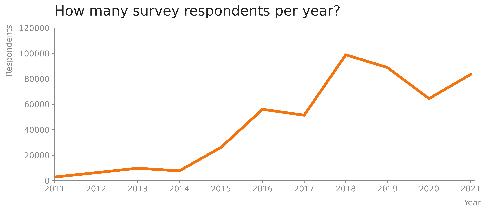
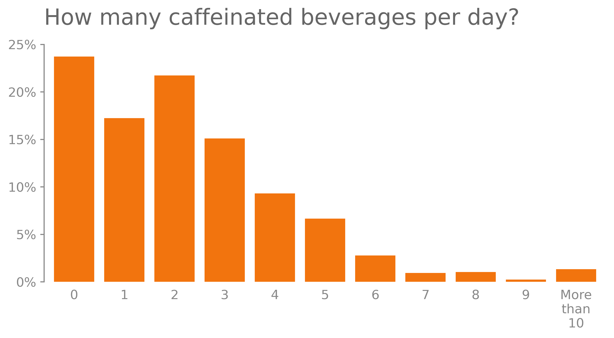
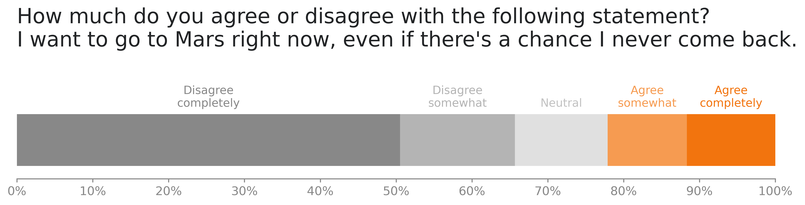

# Stack Overflow Surveys

An analysis of Stack Overflow's annual survey responses.

## Description

https://insights.stackoverflow.com/survey/2021

Article in Medium.

The project is divided into the following parts:

### 1. Load datasets

Import the required libraries and load the datasets from the local directory. The CSV files used are not available in this repository, because they exceed the maximum storage capacity offered by GitHub, but they can be downloaded [here](https://insights.stackoverflow.com/survey).

### 2. Exploratory data analysis

Explore the questions and answers to be worked with throughout the rest of the notebook, with a quick Pandas summary of them. Nine questions were selected to be ploted, they are:

1. How many survey respondents per year?
2. How many caffeinated beverages per day?
3. Tabs or spaces? (2015 and 2017)
4. How much do you agree or disagree with the following statement? I want to go to Mars right now, even if there's a chance I never come back.
5. Star Wars or Star Trek?
6. Dogs or cats?
7. Do you believe in aliens?
8. How do you pronouce "GIF"?
9. Are you the "IT support person" for your family?

### 3. Data preparation

Transform the data into the correct format to be ploted. Since the datasets provided by Stack Overflow are already clean, this means mainly making aesthetical adjustments to strings, extrating the x and y values from the DataFrames and turning some absolute values into percentages.

### 4. Visualizations

Create functions to plot the data with Matplotlib. The visualizations also use a custom Matplotlib style sheet, available in `style/stack_overflow.mplstyle`, as a starting point for the plots. This style sheet is inspired by the book [Storytelling with Data](https://www.storytellingwithdata.com), from Cole Nussbaumer Knaflic. Some examples of the graphs produced can be seen below.

### 5. Export images

Save the plots as PNG images in the folder `images/`.

## Dependencies

* Python 3.8.5
* NumPy 1.19.2
* Pandas 1.1.3
* Matplotlib 3.3.2
* Jupyter notebook 6.1.4

## Execute

1. Install the dependencies.
2. Clone the git repository: `$ git clone https://github.com/gabrieltempass/stack-overflow-survey.git`
3. Unzip the file `data/zipped_folder.zip`.
4. Go to the project's directory.
5. Open the Jupyter notebook, with the command: `$ jupyter notebook "notebook/stack_overflow_surveys.ipynb"`

## Datasets source

All the eleven datasets used in this analysis (from 2011 to 2021) are publicly available for download from Stack Overflow's website: https://insights.stackoverflow.com/survey